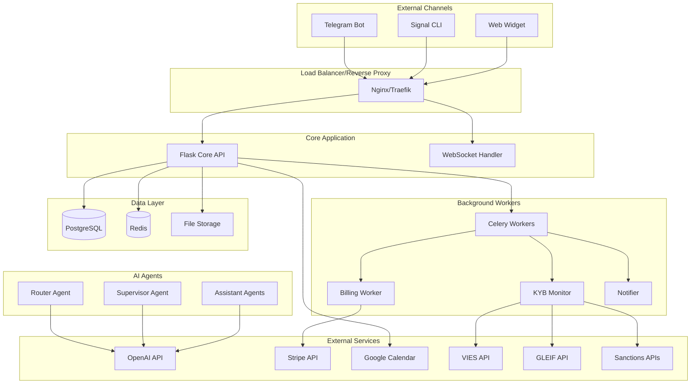
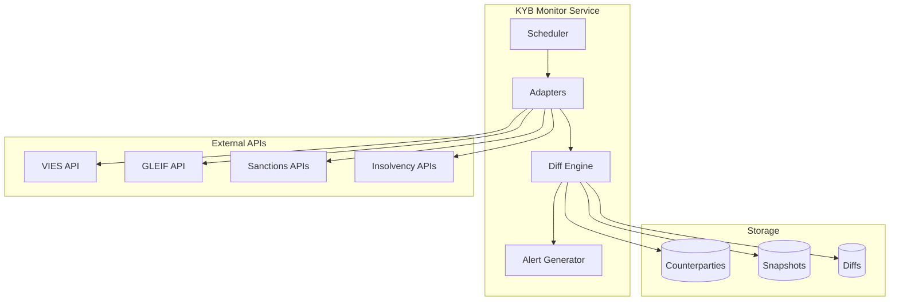

# Design Document

## Overview

The AI-Secretary SaaS platform is built as a microservices-oriented Flask application with a multi-agent AI system. The architecture supports omnichannel communication, CRM functionality, calendar integration, RAG-based knowledge management, Stripe billing, and KYB monitoring. The system uses a multi-tenant architecture with role-based access control and GDPR compliance.

## Architecture

### High-Level Architecture



### Service Architecture

The system is composed of several key services:

1. **Core API Service** - Main Flask application handling REST API and WebSocket connections
2. **Worker Service** - Celery/RQ workers for background processing
3. **Billing Worker** - Dedicated service for Stripe integration and usage metering
4. **KYB Monitor** - Specialized service for counterparty monitoring and compliance checks
5. **Notifier Service** - Handles email, Telegram, and Signal notifications

## Components and Interfaces

### 1. Core API Service (Flask)

**Responsibilities:**
- REST API endpoints for all platform functionality
- WebSocket connections for real-time communication
- Authentication and authorization
- Request routing and validation
- Multi-tenant data isolation

**Key Modules:**
- `app/api/` - REST API endpoints
- `app/auth/` - Authentication and authorization
- `app/models/` - SQLAlchemy ORM models
- `app/utils/` - Shared utilities and helpers

**API Structure:**
```
/api/v1/
├── auth/          # Authentication endpoints
├── tenants/       # Tenant management
├── channels/      # Channel configuration
├── inbox/         # Message management
├── crm/           # CRM functionality
├── calendar/      # Calendar integration
├── knowledge/     # RAG knowledge base
├── invoices/      # Invoice management
├── billing/       # Subscription management
├── kyb/           # KYB monitoring
└── admin/         # Administrative functions
```

### 2. Multi-Agent AI System

**Router Agent:**
- Detects message language, intent, and customer context
- Routes messages to appropriate specialized agents
- Maintains conversation context and history

**Supervisor Agent:**
- Filters toxic content and inappropriate language
- Detects and masks PII in conversations
- Enforces company policies and compliance rules

**Specialized Agents:**
- **Sales Agent** - Handles lead qualification and sales inquiries
- **Support Agent** - Provides technical support and troubleshooting
- **Billing Agent** - Manages subscription and payment inquiries
- **Operations Agent** - Handles general business operations

**Implementation:**
```python
class AgentOrchestrator:
    def __init__(self):
        self.router = RouterAgent()
        self.supervisor = SupervisorAgent()
        self.agents = {
            'sales': SalesAgent(),
            'support': SupportAgent(),
            'billing': BillingAgent(),
            'operations': OperationsAgent()
        }
    
    async def process_message(self, message, context):
        # Supervisor filtering
        filtered_message = await self.supervisor.filter(message)
        
        # Intent detection and routing
        intent = await self.router.detect_intent(filtered_message, context)
        agent = self.agents[intent.category]
        
        # Generate response
        response = await agent.generate_response(filtered_message, context)
        
        # Final supervisor check
        return await self.supervisor.validate_response(response)
```

### 3. Channel Integrations

**Telegram Bot Integration:**
- Uses Telegram Bot API with webhooks
- Handles text messages, files, and inline keyboards
- Maintains session state in Redis

**Signal Integration:**
- Uses signal-cli for message sending/receiving
- Implements polling mechanism for incoming messages
- Handles group and individual conversations

**Web Widget:**
- JavaScript widget for website embedding
- Real-time communication via WebSocket
- Customizable appearance and behavior

### 4. Knowledge Management (RAG)

**Document Processing Pipeline:**


**Components:**
- Document parsers for PDF, DOC, MD formats
- Web scraping for URL content extraction
- Text chunking with overlap for context preservation
- OpenAI embeddings for semantic search
- Vector similarity search with citation tracking

### 5. KYB Monitoring System

**Data Sources Integration:**
- **VIES API** - EU VAT number validation
- **GLEIF API** - LEI (Legal Entity Identifier) validation
- **Sanctions APIs** - EU, OFAC, UK sanctions lists
- **Insolvency APIs** - German insolvency notifications

**Monitoring Architecture:**


**Risk Scoring Algorithm:**
- Sanctions match: High risk (score: 90-100)
- Insolvency proceedings: Medium-high risk (score: 70-89)
- VAT/LEI validation failures: Medium risk (score: 40-69)
- Recent negative changes: Low-medium risk (score: 20-39)

## Data Models

### Core Entities

**Tenancy Model:**
```sql
-- Tenants (Organizations)
tenants: id, name, domain, settings, created_at, updated_at

-- Users
users: id, tenant_id, email, password_hash, role, is_active, created_at

-- Roles and Permissions
roles: id, name, permissions
user_roles: user_id, role_id
```

**Communication Model:**
```sql
-- Channels
channels: id, tenant_id, type, config, is_active, created_at

-- Inbox Messages
inbox_messages: id, tenant_id, channel_id, thread_id, sender_id, content, 
                metadata, ai_response, status, created_at

-- Message Threads
threads: id, tenant_id, channel_id, customer_id, subject, status, created_at

-- Attachments
attachments: id, message_id, filename, file_path, mime_type, size
```

**CRM Model:**
```sql
-- Contacts
contacts: id, tenant_id, name, email, phone, company, metadata, created_at

-- Leads
leads: id, tenant_id, contact_id, pipeline_id, stage_id, value, status, 
       source, assigned_to, created_at

-- Pipelines and Stages
pipelines: id, tenant_id, name, stages_order, created_at
stages: id, pipeline_id, name, position, color, created_at

-- Tasks
tasks: id, tenant_id, lead_id, assigned_to, title, description, due_date, 
       status, priority, created_at

-- Notes
notes: id, tenant_id, lead_id, user_id, content, created_at
```

**Knowledge Model:**
```sql
-- Knowledge Sources
knowledge_sources: id, tenant_id, name, type, url, status, last_crawled

-- Documents
documents: id, source_id, title, content, metadata, created_at

-- Text Chunks
chunks: id, document_id, content, position, embedding_vector

-- Embeddings (Vector Storage)
embeddings: id, chunk_id, vector, created_at
```

**Billing Model:**
```sql
-- Plans
plans: id, name, price, billing_interval, features, limits, is_active

-- Subscriptions
subscriptions: id, tenant_id, plan_id, stripe_subscription_id, status, 
               current_period_start, current_period_end, created_at

-- Usage Events
usage_events: id, tenant_id, subscription_id, event_type, quantity, 
              metadata, timestamp

-- Entitlements
entitlements: id, tenant_id, feature, limit_value, used_value, reset_date
```

**KYB Model:**
```sql
-- Counterparties
counterparties: id, tenant_id, name, vat_number, lei_code, country, 
                risk_score, status, created_at, updated_at

-- Snapshots
counterparty_snapshots: id, counterparty_id, source, data_hash, 
                       raw_data, created_at

-- Diffs
counterparty_diffs: id, counterparty_id, old_snapshot_id, new_snapshot_id,
                   changes, risk_impact, created_at

-- Alerts
alerts: id, tenant_id, counterparty_id, type, severity, message, 
        is_read, created_at
```

## Error Handling

### Error Categories

1. **Client Errors (4xx)**
   - Authentication failures
   - Authorization errors
   - Validation errors
   - Rate limiting

2. **Server Errors (5xx)**
   - Database connection issues
   - External API failures
   - Internal processing errors

3. **Integration Errors**
   - Stripe webhook failures
   - Google Calendar API errors
   - KYB data source timeouts

### Error Response Format

```json
{
  "error": {
    "code": "VALIDATION_ERROR",
    "message": "Invalid input data",
    "details": {
      "field": "email",
      "reason": "Invalid email format"
    },
    "request_id": "req_123456789"
  }
}
```

### Retry and Circuit Breaker Patterns

- Exponential backoff for external API calls
- Circuit breaker for unreliable services
- Dead letter queues for failed background jobs
- Graceful degradation when services are unavailable

## Testing Strategy

### Unit Testing
- Model validation and business logic
- API endpoint functionality
- Agent response generation
- Utility functions and helpers

### Integration Testing
- Database operations and migrations
- External API integrations
- Message queue processing
- Authentication and authorization flows

### End-to-End Testing
- Complete user workflows
- Multi-channel message handling
- Billing and subscription processes
- KYB monitoring and alerting

### Performance Testing
- Load testing for concurrent users
- Stress testing for message processing
- Database query optimization
- Memory and CPU usage profiling

### Security Testing
- Authentication bypass attempts
- SQL injection and XSS prevention
- Data isolation between tenants
- PII handling and GDPR compliance

### Test Data Management
- Automated test data generation
- Tenant isolation in test environments
- Mock external services for testing
- Cleanup procedures for test data

## Security Considerations

### Authentication and Authorization
- JWT tokens with refresh mechanism
- Role-based access control (RBAC)
- Multi-factor authentication support
- Session management and timeout

### Data Protection
- Encryption at rest and in transit
- PII detection and masking
- Audit logging for all data access
- Regular security assessments

### API Security
- Rate limiting and throttling
- Input validation and sanitization
- CORS configuration
- API key management

### Infrastructure Security
- Network segmentation
- Regular security updates
- Monitoring and alerting
- Backup and disaster recovery

## Deployment Architecture

### Development Environment
- Local development with Docker Compose
- Hot reloading for rapid development
- Local database and Redis instances
- Mock external services

### Staging Environment
- Production-like configuration
- Automated deployment pipeline
- Integration testing execution
- Performance monitoring

### Production Environment
- High availability setup
- Load balancing and auto-scaling
- Monitoring and alerting
- Backup and disaster recovery

### Infrastructure Components
- **Application Servers**: Multiple Flask instances behind load balancer
- **Database**: PostgreSQL with read replicas
- **Cache**: Redis cluster for session and cache data
- **Message Queue**: Celery with Redis broker
- **File Storage**: Local filesystem (MVP), S3 for production
- **Monitoring**: Prometheus, Grafana, and application logs