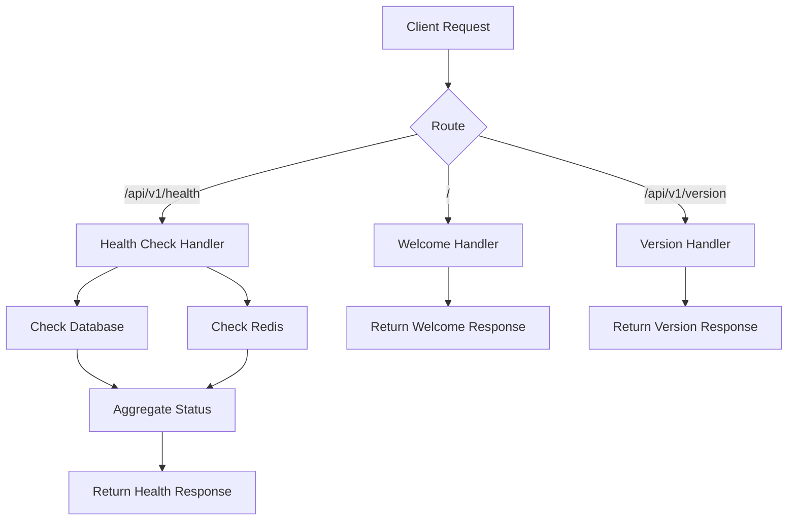

# Design Document

## Overview

This design implements basic API endpoints that provide system health checks, welcome information, and version details for the AI Secretary application. The endpoints will be lightweight, fast-responding, and provide essential information for developers and system administrators.

## Architecture

The endpoints will be implemented as part of the existing Flask application structure:

- **Root Welcome Endpoint** (`/`): Served directly from the main Flask app
- **Health Check Endpoint** (`/api/v1/health`): Part of the main API blueprint
- **Version Endpoint** (`/api/v1/version`): Part of the main API blueprint

### Request Flow



## Components and Interfaces

### 1. Welcome Endpoint Handler

**Location:** `app/api/routes.py` (main API blueprint)
**Method:** GET
**Path:** `/`

**Response Format:**
```json
{
  "message": "Welcome to AI Secretary API",
  "version": "1.0.0",
  "environment": "development",
  "endpoints": {
    "health": "/api/v1/health",
    "version": "/api/v1/version",
    "auth": "/api/v1/auth",
    "docs": "/api/v1/docs"
  },
  "timestamp": "2025-08-10T22:48:26Z"
}
```

### 2. Health Check Handler

**Location:** `app/api/routes.py`
**Method:** GET
**Path:** `/api/v1/health`

**Response Format (Healthy):**
```json
{
  "status": "healthy",
  "timestamp": "2025-08-10T22:48:26Z",
  "version": "1.0.0",
  "checks": {
    "database": {
      "status": "healthy",
      "response_time_ms": 12
    },
    "redis": {
      "status": "healthy",
      "response_time_ms": 3
    }
  }
}
```

**Response Format (Unhealthy):**
```json
{
  "status": "unhealthy",
  "timestamp": "2025-08-10T22:48:26Z",
  "version": "1.0.0",
  "checks": {
    "database": {
      "status": "unhealthy",
      "error": "Connection timeout",
      "response_time_ms": null
    },
    "redis": {
      "status": "healthy",
      "response_time_ms": 3
    }
  }
}
```

### 3. Version Handler

**Location:** `app/api/routes.py`
**Method:** GET
**Path:** `/api/v1/version`

**Response Format:**
```json
{
  "version": "1.0.0",
  "build_date": "2025-08-10T20:00:00Z",
  "environment": "development",
  "python_version": "3.10.0",
  "flask_version": "3.1.1"
}
```

### 4. Health Check Service

**Location:** `app/services/health_service.py`

**Interface:**
```python
class HealthService:
    @staticmethod
    def check_database() -> HealthCheckResult
    
    @staticmethod
    def check_redis() -> HealthCheckResult
    
    @staticmethod
    def get_overall_health() -> OverallHealthResult
```

**Data Models:**
```python
@dataclass
class HealthCheckResult:
    status: str  # "healthy" | "unhealthy"
    response_time_ms: Optional[int]
    error: Optional[str] = None

@dataclass
class OverallHealthResult:
    status: str  # "healthy" | "unhealthy"
    checks: Dict[str, HealthCheckResult]
    timestamp: str
```

## Data Models

### Configuration

The endpoints will use existing Flask configuration and add these optional settings:

```python
# In config.py
class Config:
    # ... existing config ...
    
    # API Information
    API_VERSION = "1.0.0"
    BUILD_DATE = None  # Will be set during build/deployment
    
    # Health Check Settings
    HEALTH_CHECK_TIMEOUT = 5  # seconds
    HEALTH_CHECK_DATABASE_ENABLED = True
    HEALTH_CHECK_REDIS_ENABLED = True
```

### Response Models

All endpoints will return JSON responses with consistent structure:

```python
# Base response structure
{
    "success": true,
    "data": { ... },
    "timestamp": "ISO-8601 timestamp"
}

# Error response structure
{
    "success": false,
    "error": {
        "code": "ERROR_CODE",
        "message": "Human readable message"
    },
    "timestamp": "ISO-8601 timestamp"
}
```

## Error Handling

### Health Check Errors

1. **Database Connection Failure**: Return 503 status with unhealthy status
2. **Redis Connection Failure**: Return 200 status but mark Redis as unhealthy
3. **Timeout Errors**: Treat as unhealthy and include timeout information

### General Error Handling

1. **Unexpected Exceptions**: Return 500 status with generic error message
2. **Invalid Requests**: Return 400 status with validation error details
3. **Rate Limiting**: Return 429 status (if rate limiting is enabled)

### Error Response Format

```json
{
  "success": false,
  "error": {
    "code": "HEALTH_CHECK_FAILED",
    "message": "Database connection failed",
    "details": {
      "component": "database",
      "timeout": 5000
    }
  },
  "timestamp": "2025-08-10T22:48:26Z"
}
```

## Testing Strategy

### Unit Tests

1. **Health Service Tests**
   - Test database connectivity check
   - Test Redis connectivity check
   - Test timeout handling
   - Test error scenarios

2. **Endpoint Tests**
   - Test welcome endpoint response format
   - Test health endpoint with healthy services
   - Test health endpoint with unhealthy services
   - Test version endpoint response

### Integration Tests

1. **End-to-End Health Checks**
   - Test with real database connection
   - Test with real Redis connection
   - Test with services unavailable

2. **API Response Tests**
   - Verify JSON response formats
   - Verify HTTP status codes
   - Verify response headers

### Performance Tests

1. **Response Time Tests**
   - Health check should respond within 100ms when services are healthy
   - Health check should timeout appropriately when services are slow
   - Welcome and version endpoints should respond within 50ms

### Test Data

```python
# Mock health check responses
HEALTHY_DB_RESPONSE = HealthCheckResult(
    status="healthy",
    response_time_ms=12
)

UNHEALTHY_DB_RESPONSE = HealthCheckResult(
    status="unhealthy",
    response_time_ms=None,
    error="Connection timeout"
)
```

## Security Considerations

1. **Information Disclosure**: Health checks should not expose sensitive system information
2. **Rate Limiting**: Consider rate limiting health check endpoints to prevent abuse
3. **Authentication**: These endpoints should be publicly accessible for monitoring
4. **CORS**: Ensure CORS headers are properly configured for browser access

## Performance Considerations

1. **Caching**: Health check results could be cached for 30 seconds to reduce load
2. **Timeouts**: All external service checks should have reasonable timeouts
3. **Async Operations**: Consider making health checks asynchronous for better performance
4. **Monitoring**: These endpoints will likely be called frequently by monitoring systems

## Deployment Considerations

1. **Build Information**: Build date and version should be injected during deployment
2. **Environment Detection**: Environment should be automatically detected from Flask config
3. **Health Check Dependencies**: Ensure health checks work even when some services are unavailable
4. **Logging**: All health check failures should be logged for debugging