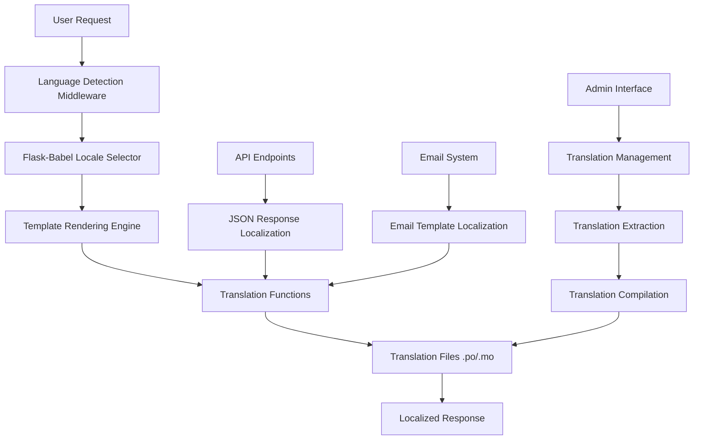

# Design Document

## Overview

This design document outlines the comprehensive internationalization (i18n) implementation for the AI Secretary application. The system will build upon the existing Flask-Babel foundation to provide complete translation coverage for all user interface elements, system messages, and content in English, German, and Ukrainian languages.

The design focuses on creating a maintainable, scalable translation system that supports dynamic language switching, proper locale formatting, and graceful fallbacks while ensuring optimal performance and user experience.

## Architecture

### High-Level Architecture



### Component Architecture

1. **Language Detection Layer**
   - URL parameter detection (`?lang=de`)
   - User profile language preference
   - Session-based language storage
   - Browser Accept-Language header fallback

2. **Translation Management Layer**
   - Flask-Babel integration
   - Translation file management (.po/.mo files)
   - Dynamic translation loading
   - Translation caching for performance

3. **Localization Services**
   - Date/time formatting
   - Number and currency formatting
   - Pluralization handling
   - RTL text support (future-ready)

4. **Frontend Integration**
   - JavaScript translation support
   - Dynamic language switching
   - Client-side locale formatting
   - Real-time language updates

## Components and Interfaces

### 1. Enhanced Language Detection Service

**File:** `app/utils/i18n.py` (enhanced)

```python
class LanguageDetectionService:
    def get_user_language(self) -> str
    def set_user_language(self, language_code: str) -> bool
    def get_browser_language(self) -> str
    def get_tenant_default_language(self) -> str
    def validate_language_code(self, language_code: str) -> bool
```

**Key Features:**
- Priority-based language detection
- Tenant-specific language defaults
- Session persistence
- User profile integration

### 2. Translation Management Service

**File:** `app/services/translation_service.py` (new)

```python
class TranslationService:
    def extract_messages(self) -> bool
    def compile_translations(self) -> bool
    def get_translation_coverage(self) -> Dict[str, float]
    def validate_translations(self) -> List[ValidationError]
    def get_missing_translations(self) -> Dict[str, List[str]]
    def update_translation(self, language: str, key: str, value: str) -> bool
```

**Key Features:**
- Automated message extraction
- Translation compilation
- Coverage reporting
- Validation and quality checks

### 3. Localization Formatter Service

**File:** `app/services/localization_service.py` (new)

```python
class LocalizationService:
    def format_date(self, date: datetime, locale: str) -> str
    def format_datetime(self, datetime: datetime, locale: str) -> str
    def format_currency(self, amount: float, currency: str, locale: str) -> str
    def format_number(self, number: float, locale: str) -> str
    def get_relative_time(self, datetime: datetime, locale: str) -> str
    def pluralize(self, count: int, singular: str, plural: str, locale: str) -> str
```

**Key Features:**
- Locale-aware formatting
- Relative time calculations
- Currency formatting
- Pluralization rules

### 4. Frontend Translation Integration

**File:** `app/static/js/i18n.js` (new)

```javascript
class I18nClient {
    constructor(locale, translations)
    translate(key, params = {})
    formatDate(date, format = 'short')
    formatNumber(number, options = {})
    formatCurrency(amount, currency = 'EUR')
    setLocale(locale)
    loadTranslations(locale)
}
```

**Key Features:**
- Client-side translation
- Dynamic locale switching
- Format utilities
- Translation caching

### 5. Email Template Localization

**File:** `app/services/email_localization_service.py` (new)

```python
class EmailLocalizationService:
    def get_localized_template(self, template_name: str, locale: str) -> str
    def render_localized_email(self, template: str, context: dict, locale: str) -> str
    def get_localized_subject(self, subject_key: str, locale: str, **kwargs) -> str
    def send_localized_email(self, recipient: User, template: str, context: dict) -> bool
```

**Key Features:**
- Template localization
- Subject line translation
- User language preference integration
- Fallback handling

## Data Models

### 1. Enhanced User Model

```python
class User(db.Model):
    # ... existing fields ...
    language = db.Column(db.String(5), default='en')
    timezone = db.Column(db.String(50), default='UTC')
    date_format_preference = db.Column(db.String(20), default='auto')
    number_format_preference = db.Column(db.String(20), default='auto')
```

### 2. Translation Cache Model

```python
class TranslationCache(db.Model):
    id = db.Column(db.Integer, primary_key=True)
    language = db.Column(db.String(5), nullable=False)
    key = db.Column(db.String(255), nullable=False)
    value = db.Column(db.Text, nullable=False)
    last_updated = db.Column(db.DateTime, default=datetime.utcnow)
    
    __table_args__ = (db.UniqueConstraint('language', 'key'),)
```

### 3. Translation Statistics Model

```python
class TranslationStats(db.Model):
    id = db.Column(db.Integer, primary_key=True)
    language = db.Column(db.String(5), nullable=False)
    total_strings = db.Column(db.Integer, default=0)
    translated_strings = db.Column(db.Integer, default=0)
    coverage_percentage = db.Column(db.Float, default=0.0)
    last_updated = db.Column(db.DateTime, default=datetime.utcnow)
```

## Error Handling

### 1. Translation Fallback Strategy

```python
class TranslationFallbackHandler:
    def get_translation(self, key: str, locale: str) -> str:
        # 1. Try requested locale
        # 2. Try user's preferred language
        # 3. Try tenant default language
        # 4. Try English (default)
        # 5. Return key as fallback
```

### 2. Missing Translation Handling

- Log missing translations for monitoring
- Display key in development mode
- Show English fallback in production
- Queue missing translations for translation

### 3. Locale Loading Errors

- Graceful degradation to English
- Error logging and monitoring
- User notification for critical failures
- Automatic retry mechanisms

## Testing Strategy

### 1. Unit Tests

**File:** `tests/test_i18n_comprehensive.py`

- Language detection logic
- Translation service methods
- Localization formatting
- Fallback mechanisms
- Cache functionality

### 2. Integration Tests

**File:** `tests/test_i18n_integration.py`

- End-to-end language switching
- Template rendering with translations
- API response localization
- Email template localization
- Database integration

### 3. Frontend Tests

**File:** `tests/frontend/test_i18n.js`

- JavaScript translation functions
- Dynamic language switching
- Client-side formatting
- Translation loading

### 4. Translation Quality Tests

**File:** `tests/test_translation_quality.py`

- Translation completeness
- Placeholder validation
- HTML tag preservation
- Character encoding validation

## Implementation Details

### 1. Translation File Structure

```
app/translations/
├── en/
│   └── LC_MESSAGES/
│       ├── messages.po
│       └── messages.mo
├── de/
│   └── LC_MESSAGES/
│       ├── messages.po
│       └── messages.mo
└── uk/
    └── LC_MESSAGES/
        ├── messages.po
        └── messages.mo
```

### 2. Template Translation Patterns

```html
<!-- Basic translation -->
{{ _('Welcome') }}

<!-- Translation with parameters -->
{{ _('Hello %(name)s', name=user.name) }}

<!-- Pluralization -->
{{ ngettext('%(num)d item', '%(num)d items', count, num=count) }}

<!-- Lazy translation for forms -->
{{ _l('Email Address') }}
```

### 3. JavaScript Translation Integration

```javascript
// Translation function
function _(key, params = {}) {
    return window.i18n.translate(key, params);
}

// Usage in templates
<script>
window.i18n = new I18nClient('{{ get_locale() }}', {{ translations|tojson }});
</script>
```

### 4. API Response Localization

```python
@api.route('/endpoint')
def api_endpoint():
    return success_response(
        message=_('Operation completed successfully'),
        data=localize_model_data(data, get_locale())
    )
```

### 5. Email Template Localization

```python
def send_welcome_email(user):
    template = get_localized_template('welcome', user.language)
    subject = _('Welcome to AI Secretary')
    
    send_email(
        recipient=user.email,
        subject=subject,
        template=template,
        context={'user': user}
    )
```

## Performance Considerations

### 1. Translation Caching

- In-memory caching of compiled translations
- Redis caching for distributed deployments
- Cache invalidation on translation updates
- Lazy loading of translation files

### 2. Bundle Optimization

- Separate translation bundles per language
- On-demand loading of translations
- Compression of translation files
- CDN distribution for static translations

### 3. Database Optimization

- Indexed language columns
- Efficient translation queries
- Connection pooling for translation services
- Batch operations for bulk updates

## Security Considerations

### 1. Input Validation

- Language code validation
- Translation content sanitization
- XSS prevention in translated content
- SQL injection prevention

### 2. Access Control

- Translation management permissions
- Tenant isolation for translations
- User role-based translation access
- API endpoint protection

### 3. Content Security

- HTML tag preservation in translations
- Script injection prevention
- Content encoding validation
- Translation audit logging

## Monitoring and Analytics

### 1. Translation Metrics

- Translation coverage per language
- Missing translation tracking
- Translation usage statistics
- Performance metrics

### 2. User Language Analytics

- Language preference distribution
- Language switching patterns
- Geographic language usage
- Feature usage by language

### 3. Error Monitoring

- Translation loading failures
- Missing translation alerts
- Locale formatting errors
- Fallback usage tracking

## Deployment Strategy

### 1. Development Environment

- Hot-reloading of translations
- Translation extraction automation
- Development-specific error handling
- Translation debugging tools

### 2. Staging Environment

- Translation validation
- Performance testing
- User acceptance testing
- Translation completeness checks

### 3. Production Environment

- Compiled translation deployment
- Cache warming strategies
- Rollback procedures
- Monitoring and alerting

## Future Enhancements

### 1. Additional Languages

- Framework for adding new languages
- Community translation support
- Translation management interface
- Automated translation suggestions

### 2. Advanced Features

- Right-to-left (RTL) language support
- Context-aware translations
- Machine translation integration
- Translation memory systems

### 3. Performance Optimizations

- Translation preloading
- Predictive caching
- Edge caching strategies
- Translation compression