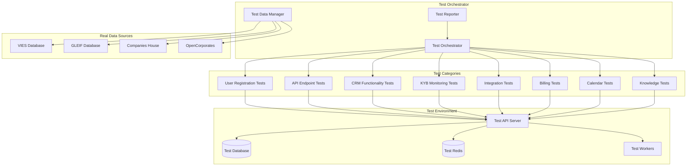

# Design Document

## Overview

Данный документ описывает архитектуру и подход к комплексному тестированию AI Secretary SaaS платформы. Тестирование будет проводиться с использованием реальных данных компаний из открытых источников для максимальной реалистичности проверок.

## Architecture

### Testing Framework Architecture



## Components and Interfaces

### 1. Test Orchestrator

**Responsibilities:**
- Координация выполнения всех тестовых сценариев
- Управление последовательностью тестов
- Сбор и агрегация результатов
- Генерация отчетов с планами исправления

**Key Methods:**
```python
class TestOrchestrator:
    def run_comprehensive_test_suite(self) -> TestSuiteResult
    def setup_test_environment(self) -> bool
    def cleanup_test_environment(self) -> bool
    def generate_final_report(self, results: List[TestResult]) -> ComprehensiveReport
```

### 2. Test Data Manager

**Responsibilities:**
- Получение реальных данных компаний из открытых источников
- Валидация и подготовка тестовых данных
- Управление тестовыми наборами данных

**Real Company Data Sources:**
- **VIES Database**: EU VAT номера для KYB тестирования
- **GLEIF Database**: LEI коды для корпоративной идентификации
- **Companies House (UK)**: Публичные данные британских компаний
- **OpenCorporates**: Международная база данных компаний

**Sample Test Data:**
```python
REAL_COMPANY_DATA = {
    "microsoft_ireland": {
        "name": "Microsoft Ireland Operations Limited",
        "vat_number": "IE9825613N",
        "country": "IE",
        "lei_code": "635400AKJKKLMN4KNZ71",
        "address": "One Microsoft Place, South County Business Park, Leopardstown, Dublin 18"
    },
    "sap_germany": {
        "name": "SAP SE",
        "vat_number": "DE143593636",
        "country": "DE", 
        "lei_code": "529900T8BM49AURSDO55",
        "address": "Dietmar-Hopp-Allee 16, 69190 Walldorf"
    },
    "unilever_uk": {
        "name": "Unilever PLC",
        "vat_number": "GB440861235",
        "country": "GB",
        "lei_code": "549300BFXFJ6KBNTKY86",
        "address": "100 Victoria Embankment, London EC4Y 0DY"
    }
}
```

### 3. User Registration Test Suite

**Test Scenarios:**
1. **Complete Registration Flow**
   - Email validation and confirmation
   - Password strength requirements
   - Company data validation
   - Trial activation

2. **Multi-tenant Isolation**
   - Tenant creation and configuration
   - Data isolation verification
   - User role assignment

3. **OAuth Integration**
   - Google OAuth flow
   - Token management
   - Profile synchronization

### 4. API Endpoint Test Suite

**Test Categories:**
1. **Authentication Endpoints**
   - `/api/v1/auth/login`
   - `/api/v1/auth/register`
   - `/api/v1/auth/refresh`
   - `/api/v1/auth/google/callback`

2. **Core Business Endpoints**
   - `/api/v1/tenants`
   - `/api/v1/crm/contacts`
   - `/api/v1/crm/leads`
   - `/api/v1/kyb/counterparties`
   - `/api/v1/calendar/events`

3. **Integration Endpoints**
   - `/api/v1/channels/telegram/webhook`
   - `/api/v1/billing/webhooks/stripe`
   - `/api/v1/knowledge/search`

### 5. CRM Functionality Test Suite

**Test Workflows:**
1. **Contact Management**
   - Create contact with real company data
   - Update contact information
   - Search and filter contacts
   - Contact deduplication

2. **Lead Pipeline Management**
   - Create lead from contact
   - Move lead through pipeline stages
   - Calculate conversion rates
   - Lead assignment and routing

3. **Task and Activity Management**
   - Create tasks for leads
   - Set due dates and reminders
   - Track task completion
   - Activity logging

### 6. KYB Monitoring Test Suite

**Real Data Integration:**
1. **VIES Integration Testing**
   - Validate real EU VAT numbers
   - Handle different country formats
   - Process batch validations
   - Error handling for invalid numbers

2. **GLEIF Integration Testing**
   - Lookup real LEI codes
   - Retrieve corporate hierarchy
   - Monitor status changes
   - Handle API rate limits

3. **Sanctions Screening**
   - Check against EU sanctions lists
   - OFAC SDN list screening
   - UK HMT sanctions checking
   - False positive handling

### 7. AI Agent Test Suite

**Agent Testing:**
1. **Router Agent**
   - Language detection (EN/DE/UK)
   - Intent classification
   - Context determination
   - Agent routing decisions

2. **Specialized Agents**
   - Sales agent lead qualification
   - Support agent issue resolution
   - Billing agent payment queries
   - Operations agent general tasks

3. **Supervisor Agent**
   - Content filtering
   - PII detection and masking
   - Policy compliance checking
   - Response validation

## Data Models

### Test Result Models

```python
@dataclass
class TestResult:
    test_name: str
    status: TestStatus  # PASSED, FAILED, SKIPPED, ERROR
    execution_time: float
    error_message: Optional[str]
    details: Dict[str, Any]
    timestamp: datetime

@dataclass
class TestSuiteResult:
    suite_name: str
    total_tests: int
    passed: int
    failed: int
    skipped: int
    errors: int
    execution_time: float
    test_results: List[TestResult]

@dataclass
class ComprehensiveReport:
    overall_status: str
    total_execution_time: float
    suite_results: List[TestSuiteResult]
    critical_issues: List[Issue]
    improvement_plan: List[ActionItem]
    user_action_required: List[UserAction]
```

### Issue Tracking Models

```python
@dataclass
class Issue:
    id: str
    severity: IssueSeverity  # CRITICAL, HIGH, MEDIUM, LOW
    category: IssueCategory  # FUNCTIONALITY, PERFORMANCE, SECURITY, USABILITY
    title: str
    description: str
    affected_components: List[str]
    reproduction_steps: List[str]
    expected_behavior: str
    actual_behavior: str
    fix_priority: int
    estimated_effort: str

@dataclass
class ActionItem:
    id: str
    title: str
    description: str
    priority: Priority  # HIGH, MEDIUM, LOW
    estimated_time: str
    assigned_to: str
    dependencies: List[str]
    acceptance_criteria: List[str]

@dataclass
class UserAction:
    id: str
    title: str
    description: str
    urgency: Urgency  # IMMEDIATE, SOON, WHEN_CONVENIENT
    instructions: List[str]
    expected_outcome: str
```

## Error Handling

### Test Execution Error Handling

1. **Environment Setup Failures**
   - Database connection issues
   - Redis connectivity problems
   - Missing API keys or configuration
   - External service unavailability

2. **Test Data Issues**
   - Invalid real company data
   - API rate limit exceeded
   - External service timeouts
   - Data format inconsistencies

3. **Application Errors**
   - Unhandled exceptions
   - Database constraint violations
   - Authentication failures
   - Integration service errors

### Error Recovery Strategies

```python
class ErrorRecoveryStrategy:
    def handle_database_error(self, error: DatabaseError) -> RecoveryAction
    def handle_api_rate_limit(self, service: str) -> RecoveryAction
    def handle_external_service_timeout(self, service: str) -> RecoveryAction
    def handle_authentication_failure(self, context: str) -> RecoveryAction
```

## Testing Strategy

### Test Execution Phases

1. **Phase 1: Environment Setup**
   - Initialize test database
   - Configure test Redis instance
   - Set up test API server
   - Prepare real company data

2. **Phase 2: User Registration Testing**
   - Test complete registration flow
   - Verify tenant creation
   - Validate email confirmation
   - Check trial activation

3. **Phase 3: Core API Testing**
   - Authentication endpoints
   - CRUD operations
   - Data validation
   - Error handling

4. **Phase 4: Business Logic Testing**
   - CRM workflows
   - KYB monitoring
   - AI agent interactions
   - Integration flows

5. **Phase 5: End-to-End Testing**
   - Complete user journeys
   - Cross-component integration
   - Performance validation
   - Security verification

6. **Phase 6: Reporting and Analysis**
   - Generate detailed reports
   - Identify critical issues
   - Create improvement plans
   - Document user actions

### Test Data Strategy

**Real Company Selection Criteria:**
- Companies from different EU countries for VAT testing
- Mix of large corporations and SMEs
- Companies with active LEI codes
- Publicly available information only
- No sensitive or confidential data

**Data Refresh Strategy:**
- Daily validation of VAT numbers
- Weekly LEI code status checks
- Monthly sanctions list updates
- Quarterly company data refresh

### Performance Testing

**Load Testing Scenarios:**
- Concurrent user registrations
- Bulk KYB monitoring requests
- High-volume message processing
- Simultaneous API calls

**Performance Metrics:**
- Response time percentiles (P50, P95, P99)
- Throughput (requests per second)
- Error rates under load
- Resource utilization

### Security Testing

**Security Test Categories:**
1. **Authentication Security**
   - JWT token validation
   - Session management
   - Password security
   - OAuth flow security

2. **Authorization Testing**
   - Role-based access control
   - Tenant data isolation
   - API endpoint permissions
   - Resource access validation

3. **Data Protection**
   - PII handling
   - Data encryption
   - Audit logging
   - GDPR compliance

### Monitoring and Observability

**Test Execution Monitoring:**
- Real-time test progress tracking
- Performance metrics collection
- Error rate monitoring
- Resource usage tracking

**Alerting Strategy:**
- Critical test failures
- Performance degradation
- External service issues
- Security violations

## Integration Points

### External Service Integration

1. **VIES API Integration**
   - SOAP service testing
   - Rate limit handling
   - Error response processing
   - Batch operation testing

2. **GLEIF API Integration**
   - REST API testing
   - Authentication handling
   - Data parsing validation
   - Pagination support

3. **Stripe Integration**
   - Webhook processing
   - Payment flow testing
   - Subscription management
   - Error handling

4. **Google Calendar Integration**
   - OAuth flow testing
   - Event synchronization
   - Webhook handling
   - Permission validation

### Internal Service Integration

1. **Database Integration**
   - Multi-tenant data isolation
   - Transaction handling
   - Connection pooling
   - Migration testing

2. **Redis Integration**
   - Caching functionality
   - Session storage
   - Queue management
   - Pub/sub messaging

3. **Celery Workers**
   - Task queue processing
   - Background job execution
   - Error handling
   - Retry mechanisms

## Deployment Considerations

### Test Environment Requirements

**Infrastructure:**
- Isolated test database
- Dedicated Redis instance
- Test API server
- Worker processes

**Configuration:**
- Test-specific environment variables
- Mock external services where needed
- Logging configuration
- Monitoring setup

**Data Management:**
- Test data seeding
- Database cleanup
- State isolation
- Backup and restore

### CI/CD Integration

**Automated Testing Pipeline:**
1. Code checkout and build
2. Test environment setup
3. Test data preparation
4. Test suite execution
5. Report generation
6. Environment cleanup

**Quality Gates:**
- Minimum test coverage
- Performance thresholds
- Security scan results
- Code quality metrics