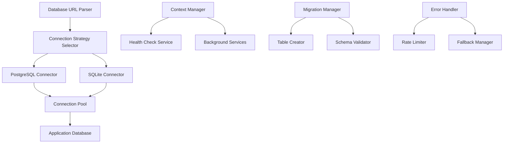
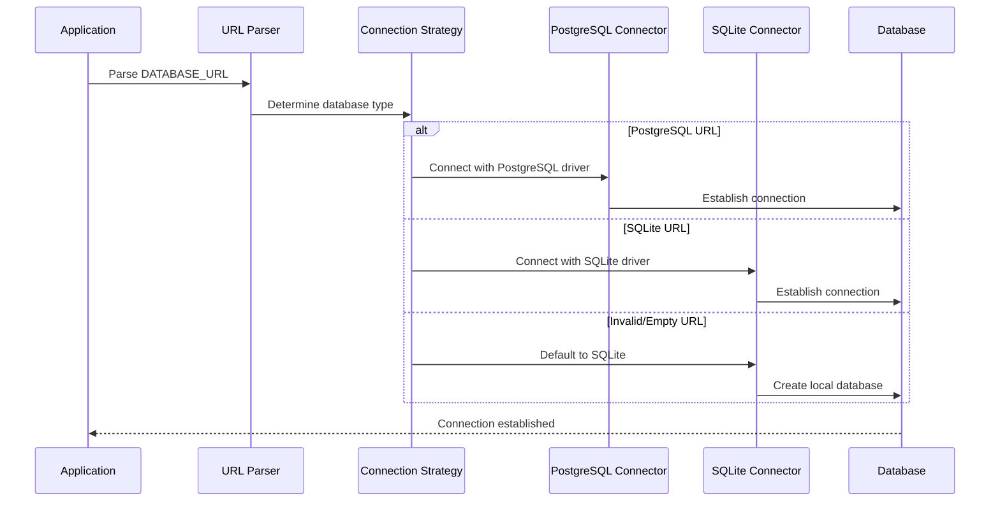

# Database Connection and Context Fixes Design

## Overview

This document describes the design for fixing critical database connection issues, missing tables, and Flask application context errors in the AI Secretary application. The solution focuses on intelligent database type detection, proper context management, and graceful error handling.

## Architecture

### System Components



### Database Connection Flow



## Components and Interfaces

### 1. Database URL Parser

**Purpose:** Intelligently parse and validate database URLs to determine the correct connection strategy.

```python
class DatabaseURLParser:
    def parse_url(self, url: str) -> DatabaseConfig:
        """Parse database URL and return configuration."""
        pass
    
    def detect_database_type(self, url: str) -> DatabaseType:
        """Detect database type from URL scheme."""
        pass
    
    def validate_url(self, url: str) -> ValidationResult:
        """Validate URL format and accessibility."""
        pass

@dataclass
class DatabaseConfig:
    type: DatabaseType
    connection_string: str
    driver: str
    options: Dict[str, Any]
    is_valid: bool
    error_message: Optional[str]

class DatabaseType(Enum):
    POSTGRESQL = "postgresql"
    SQLITE = "sqlite"
    UNKNOWN = "unknown"
```

### 2. Smart Connection Manager

**Purpose:** Replace the current connection logic with intelligent type detection and proper error handling.

```python
class SmartConnectionManager:
    def __init__(self):
        self.parser = DatabaseURLParser()
        self.connectors = {
            DatabaseType.POSTGRESQL: PostgreSQLConnector(),
            DatabaseType.SQLITE: SQLiteConnector()
        }
    
    def connect(self, url: Optional[str] = None) -> ConnectionResult:
        """Connect using intelligent type detection."""
        if not url:
            url = os.environ.get('DATABASE_URL', 'sqlite:///ai_secretary.db')
        
        config = self.parser.parse_url(url)
        
        if not config.is_valid:
            logger.error(f"Invalid database URL: {config.error_message}")
            return self._fallback_to_sqlite()
        
        connector = self.connectors.get(config.type)
        if not connector:
            logger.warning(f"Unsupported database type: {config.type}")
            return self._fallback_to_sqlite()
        
        return connector.connect(config)
    
    def _fallback_to_sqlite(self) -> ConnectionResult:
        """Fallback to SQLite with safe defaults."""
        sqlite_config = DatabaseConfig(
            type=DatabaseType.SQLITE,
            connection_string='sqlite:///ai_secretary.db',
            driver='sqlite3',
            options={},
            is_valid=True,
            error_message=None
        )
        return self.connectors[DatabaseType.SQLITE].connect(sqlite_config)
```

### 3. Application Context Manager

**Purpose:** Ensure all background services and health checks have proper Flask application context.

```python
class ApplicationContextManager:
    def __init__(self, app: Flask):
        self.app = app
        self._context_stack = []
    
    def ensure_context(self, func: Callable) -> Callable:
        """Decorator to ensure Flask application context."""
        @wraps(func)
        def wrapper(*args, **kwargs):
            if has_app_context():
                return func(*args, **kwargs)
            
            with self.app.app_context():
                return func(*args, **kwargs)
        return wrapper
    
    def run_with_context(self, func: Callable, *args, **kwargs):
        """Run function with guaranteed application context."""
        with self.app.app_context():
            return func(*args, **kwargs)
    
    def create_background_context(self) -> ContextManager:
        """Create context manager for background tasks."""
        return self.app.app_context()
```

### 4. Migration and Table Manager

**Purpose:** Automatically create missing tables and handle database schema updates.

```python
class MigrationManager:
    def __init__(self, db_manager: SmartConnectionManager):
        self.db_manager = db_manager
        self.required_tables = [
            'performance_alerts',
            'users',
            'tenants',
            # ... other required tables
        ]
    
    def ensure_tables_exist(self) -> bool:
        """Ensure all required tables exist."""
        missing_tables = self.check_missing_tables()
        
        if missing_tables:
            logger.info(f"Creating missing tables: {missing_tables}")
            return self.create_missing_tables(missing_tables)
        
        return True
    
    def check_missing_tables(self) -> List[str]:
        """Check which required tables are missing."""
        pass
    
    def create_missing_tables(self, tables: List[str]) -> bool:
        """Create missing tables with proper schema."""
        pass
    
    def create_performance_alerts_table(self) -> bool:
        """Create the performance_alerts table specifically."""
        schema = """
        CREATE TABLE IF NOT EXISTS performance_alerts (
            id INTEGER PRIMARY KEY AUTOINCREMENT,
            alert_type VARCHAR(50) NOT NULL,
            severity VARCHAR(20) NOT NULL,
            title VARCHAR(200) NOT NULL,
            description TEXT,
            endpoint VARCHAR(200),
            service_name VARCHAR(100),
            metric_value FLOAT,
            threshold_value FLOAT,
            status VARCHAR(20) DEFAULT 'active',
            acknowledged_by VARCHAR(100),
            acknowledged_at TIMESTAMP,
            resolved_at TIMESTAMP,
            first_occurrence TIMESTAMP DEFAULT CURRENT_TIMESTAMP,
            last_occurrence TIMESTAMP DEFAULT CURRENT_TIMESTAMP,
            occurrence_count INTEGER DEFAULT 1,
            alert_metadata TEXT,
            created_at TIMESTAMP DEFAULT CURRENT_TIMESTAMP,
            updated_at TIMESTAMP DEFAULT CURRENT_TIMESTAMP
        );
        """
        return self._execute_schema(schema)
```

### 5. Service Health Manager

**Purpose:** Fix health checks and background services to work without context errors.

```python
class ServiceHealthManager:
    def __init__(self, app: Flask, context_manager: ApplicationContextManager):
        self.app = app
        self.context_manager = context_manager
        self.services = {}
        self.health_check_interval = 30
    
    @property
    def ensure_context(self):
        """Decorator for ensuring context in health checks."""
        return self.context_manager.ensure_context
    
    @ensure_context
    def check_database_health(self) -> HealthStatus:
        """Check database health with proper context."""
        try:
            # Database health check logic
            return HealthStatus.HEALTHY
        except Exception as e:
            logger.error(f"Database health check failed: {e}")
            return HealthStatus.UNHEALTHY
    
    @ensure_context
    def check_redis_health(self) -> HealthStatus:
        """Check Redis health with fallback."""
        redis_url = os.environ.get('REDIS_URL', '')
        
        if not redis_url or redis_url.strip() == '':
            logger.debug("Redis not configured, using fallback cache")
            return HealthStatus.DISABLED
        
        try:
            # Redis health check logic
            return HealthStatus.HEALTHY
        except Exception as e:
            logger.warning(f"Redis unavailable, using fallback: {e}")
            return HealthStatus.FALLBACK
    
    def start_background_monitoring(self):
        """Start background health monitoring with proper context."""
        def monitor_loop():
            while True:
                with self.context_manager.create_background_context():
                    self._run_health_checks()
                time.sleep(self.health_check_interval)
        
        thread = threading.Thread(target=monitor_loop, daemon=True)
        thread.start()
```

## Data Models

### Connection Result

```python
@dataclass
class ConnectionResult:
    success: bool
    database_type: DatabaseType
    connection_string: str
    engine: Optional[Engine]
    error_message: Optional[str]
    fallback_used: bool = False
```

### Health Status

```python
class HealthStatus(Enum):
    HEALTHY = "healthy"
    UNHEALTHY = "unhealthy"
    DISABLED = "disabled"
    FALLBACK = "fallback"
    UNKNOWN = "unknown"

@dataclass
class ServiceHealth:
    service_name: str
    status: HealthStatus
    last_check: datetime
    error_message: Optional[str]
    response_time: Optional[float]
```

## Error Handling

### Error Categories and Responses

1. **Database Connection Errors**
   - Invalid URL format → Clear error message with examples
   - Connection timeout → Retry with exponential backoff
   - Authentication failure → Check credentials message
   - Database not found → Auto-create for SQLite, error for PostgreSQL

2. **Context Errors**
   - Missing app context → Automatically wrap with context
   - Context already exists → Use existing context
   - Context creation failure → Log error and continue with degraded functionality

3. **Service Unavailability**
   - Redis unavailable → Use simple cache fallback
   - External API down → Disable feature gracefully
   - WebSocket failure → Disable real-time features

### Error Rate Limiting

```python
class ErrorRateLimiter:
    def __init__(self, max_errors_per_minute: int = 5):
        self.max_errors = max_errors_per_minute
        self.error_counts = defaultdict(list)
    
    def should_log_error(self, error_key: str) -> bool:
        """Determine if error should be logged based on rate limit."""
        now = time.time()
        minute_ago = now - 60
        
        # Clean old errors
        self.error_counts[error_key] = [
            timestamp for timestamp in self.error_counts[error_key]
            if timestamp > minute_ago
        ]
        
        # Check if under limit
        if len(self.error_counts[error_key]) < self.max_errors:
            self.error_counts[error_key].append(now)
            return True
        
        return False
```

## Testing Strategy

### Unit Tests

1. **Database URL Parser Tests**
   - Test various URL formats (PostgreSQL, SQLite, invalid)
   - Test edge cases (empty, malformed, missing components)
   - Test validation logic

2. **Connection Manager Tests**
   - Test connection with different database types
   - Test fallback behavior
   - Test error handling

3. **Context Manager Tests**
   - Test context creation and cleanup
   - Test decorator functionality
   - Test background task context

### Integration Tests

1. **Database Connection Integration**
   - Test actual connections to test databases
   - Test migration execution
   - Test table creation

2. **Service Health Integration**
   - Test health checks with real services
   - Test fallback behavior
   - Test background monitoring

### Error Simulation Tests

1. **Connection Failure Simulation**
   - Simulate database unavailability
   - Test timeout handling
   - Test retry logic

2. **Context Error Simulation**
   - Simulate missing Flask context
   - Test context recovery
   - Test error propagation

## Performance Considerations

### Connection Pooling

- Use SQLAlchemy connection pooling for PostgreSQL
- Implement connection reuse for SQLite
- Configure appropriate pool sizes based on environment

### Background Task Optimization

- Minimize context creation overhead
- Use connection sharing where possible
- Implement efficient health check scheduling

### Error Handling Performance

- Use efficient error rate limiting
- Minimize logging overhead for repeated errors
- Cache validation results where appropriate

## Security Considerations

### Database Security

- Validate all connection strings before use
- Sanitize database URLs in logs
- Use secure connection options when available

### Context Security

- Ensure proper context isolation
- Prevent context leakage between requests
- Validate context state before operations

### Error Information Security

- Avoid exposing sensitive information in error messages
- Sanitize connection details in logs
- Use appropriate log levels for different error types