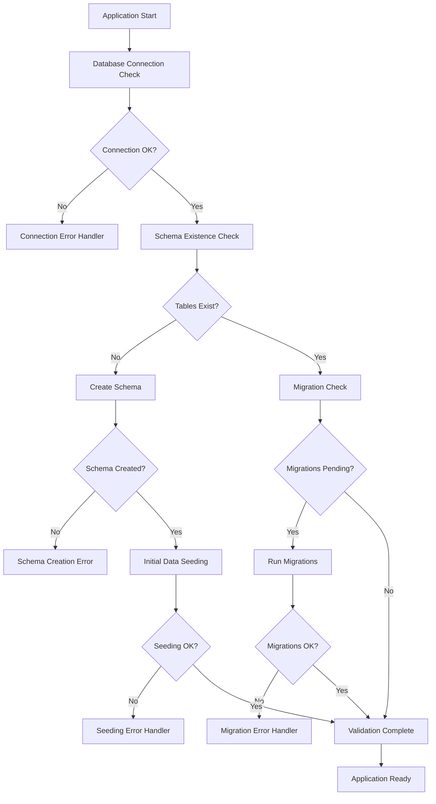
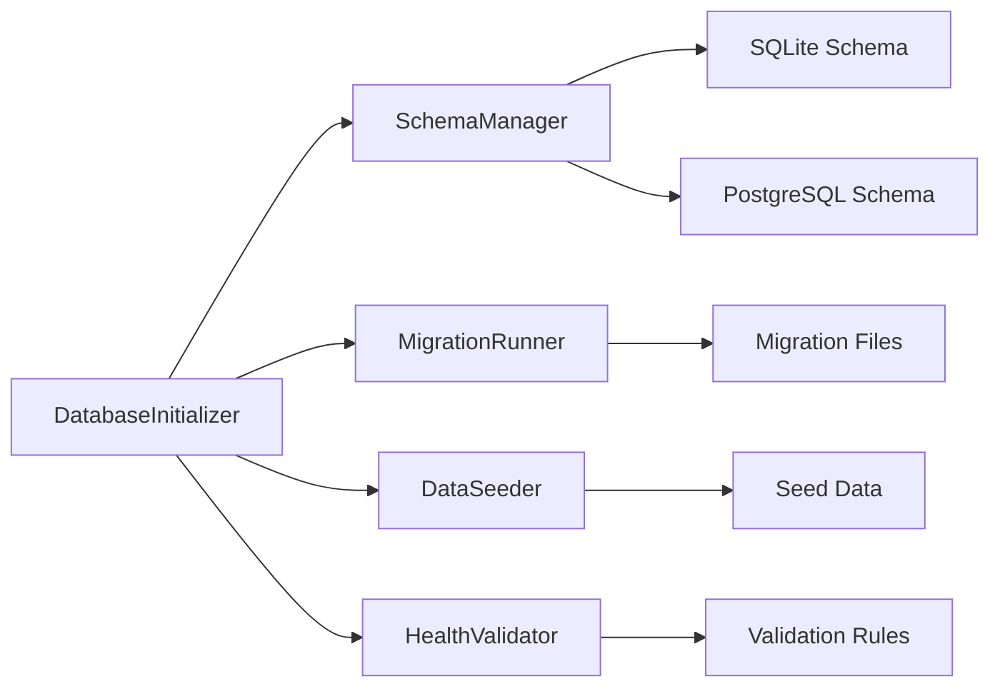

# Design Document

## Overview

This design addresses the critical database initialization failures by implementing a robust database setup system that automatically creates schemas, runs migrations, and seeds initial data. The solution ensures the application can start successfully regardless of the current database state and provides comprehensive error handling and recovery mechanisms.

## Architecture

### Database Initialization Flow



### Component Architecture



## Components and Interfaces

### 1. Database Initializer

**Purpose:** Orchestrate the complete database initialization process

**Interface:**
```python
class DatabaseInitializer:
    def __init__(self, app: Flask, db: SQLAlchemy)
    def initialize(self) -> InitializationResult
    def validate_setup(self) -> ValidationResult
    def repair_if_needed(self) -> RepairResult
    def get_initialization_status(self) -> Dict[str, Any]
```

**Responsibilities:**
- Coordinate all initialization steps
- Handle errors and recovery
- Provide status reporting
- Manage initialization logging

### 2. Schema Manager

**Purpose:** Handle database schema creation and validation

**Interface:**
```python
class SchemaManager:
    def check_schema_exists(self) -> bool
    def create_schema(self) -> bool
    def validate_schema(self) -> ValidationResult
    def repair_schema(self) -> RepairResult
    def get_schema_info(self) -> Dict[str, Any]
```

**Responsibilities:**
- Detect existing database schema
- Create missing tables and indexes
- Validate schema integrity
- Repair corrupted schemas

### 3. Migration Runner

**Purpose:** Execute database migrations safely and reliably

**Interface:**
```python
class MigrationRunner:
    def check_pending_migrations(self) -> List[str]
    def run_migrations(self) -> MigrationResult
    def rollback_migration(self, migration_id: str) -> bool
    def get_migration_history(self) -> List[Dict[str, Any]]
```

**Responsibilities:**
- Detect pending migrations
- Execute migrations in correct order
- Handle migration failures
- Maintain migration history

### 4. Data Seeder

**Purpose:** Create essential initial data for application functionality

**Interface:**
```python
class DataSeeder:
    def seed_initial_data(self) -> SeedingResult
    def create_admin_user(self) -> bool
    def create_system_tenants(self) -> bool
    def validate_seed_data(self) -> bool
```

**Responsibilities:**
- Create default admin user
- Set up system tenants and roles
- Validate seeded data integrity
- Skip existing data during re-seeding

### 5. Health Validator

**Purpose:** Validate database health and provide diagnostic information

**Interface:**
```python
class HealthValidator:
    def validate_connectivity(self) -> bool
    def validate_schema_integrity(self) -> ValidationResult
    def validate_data_integrity(self) -> ValidationResult
    def generate_health_report(self) -> Dict[str, Any]
```

**Responsibilities:**
- Test database connectivity
- Validate table structures
- Check data consistency
- Generate diagnostic reports

## Data Models

### Initialization Result Models

```python
@dataclass
class InitializationResult:
    success: bool
    steps_completed: List[str]
    errors: List[str]
    warnings: List[str]
    duration: float
    database_type: str

@dataclass
class ValidationResult:
    valid: bool
    issues: List[str]
    suggestions: List[str]
    severity: str  # 'info', 'warning', 'error', 'critical'

@dataclass
class MigrationResult:
    success: bool
    migrations_applied: List[str]
    failed_migration: Optional[str]
    error_message: Optional[str]
    rollback_performed: bool

@dataclass
class SeedingResult:
    success: bool
    records_created: Dict[str, int]
    records_skipped: Dict[str, int]
    errors: List[str]
```

### Database Schema Definitions

The schema will be defined using SQLAlchemy models but with explicit table creation methods:

```python
class SchemaDefinition:
    @staticmethod
    def get_table_definitions() -> Dict[str, str]:
        """Return SQL DDL for all tables"""
        
    @staticmethod
    def get_index_definitions() -> Dict[str, str]:
        """Return SQL DDL for all indexes"""
        
    @staticmethod
    def get_constraint_definitions() -> Dict[str, str]:
        """Return SQL DDL for all constraints"""
```

## Error Handling

### Database Connection Errors

1. **Connection Refused**
   - Log specific connection error details
   - Provide database-specific troubleshooting steps
   - Suggest alternative database configurations
   - Exit gracefully with clear error message

2. **Authentication Failures**
   - Log authentication error without exposing credentials
   - Suggest credential verification steps
   - Provide configuration file examples
   - Exit with security-conscious error message

3. **Permission Errors**
   - Log permission-related errors
   - Suggest file/directory permission fixes
   - Provide database user permission requirements
   - Offer alternative configuration options

### Schema Creation Errors

1. **Table Creation Failures**
   - Log specific SQL errors
   - Identify conflicting existing objects
   - Suggest manual cleanup procedures
   - Provide alternative schema creation methods

2. **Index Creation Failures**
   - Log index creation errors
   - Suggest index recreation procedures
   - Identify performance implications
   - Continue with warnings if non-critical

3. **Constraint Violations**
   - Log constraint-related errors
   - Suggest data cleanup procedures
   - Provide constraint modification options
   - Handle gracefully for non-critical constraints

### Migration Errors

1. **Migration File Corruption**
   - Detect corrupted migration files
   - Suggest migration file restoration
   - Provide manual migration procedures
   - Maintain migration history integrity

2. **Data Migration Failures**
   - Log data transformation errors
   - Provide data backup recommendations
   - Suggest manual data fixes
   - Implement rollback procedures

3. **Version Conflicts**
   - Detect migration version conflicts
   - Suggest conflict resolution procedures
   - Provide migration history repair
   - Maintain database consistency

## Testing Strategy

### Unit Tests

1. **Database Initializer Tests**
   - Test initialization flow with various database states
   - Test error handling for each initialization step
   - Test recovery mechanisms
   - Mock database connections and operations

2. **Schema Manager Tests**
   - Test schema detection logic
   - Test table creation with different database types
   - Test schema validation rules
   - Test repair mechanisms

3. **Migration Runner Tests**
   - Test migration detection and execution
   - Test rollback mechanisms
   - Test migration history management
   - Test error handling during migrations

4. **Data Seeder Tests**
   - Test initial data creation
   - Test duplicate data handling
   - Test seeding with existing data
   - Test data validation after seeding

### Integration Tests

1. **End-to-End Initialization**
   - Test complete initialization from empty database
   - Test initialization with partially created schema
   - Test initialization with corrupted data
   - Test initialization across different database types

2. **Error Recovery Tests**
   - Test recovery from connection failures
   - Test recovery from schema creation errors
   - Test recovery from migration failures
   - Test recovery from seeding errors

3. **Environment-Specific Tests**
   - Test initialization in development environment
   - Test initialization in testing environment
   - Test initialization with production-like data
   - Test database type switching

### Performance Tests

1. **Initialization Performance**
   - Measure initialization time for different database sizes
   - Test concurrent initialization attempts
   - Measure memory usage during initialization
   - Test initialization with large migration sets

2. **Schema Creation Performance**
   - Measure table creation time
   - Test index creation performance
   - Measure constraint creation time
   - Test schema validation performance

## Implementation Phases

### Phase 1: Core Infrastructure
- Implement DatabaseInitializer class
- Create basic error handling framework
- Add logging and status reporting
- Implement basic connectivity testing

### Phase 2: Schema Management
- Implement SchemaManager class
- Add table creation logic
- Implement schema validation
- Add repair mechanisms

### Phase 3: Migration System
- Implement MigrationRunner class
- Add migration detection and execution
- Implement rollback mechanisms
- Add migration history tracking

### Phase 4: Data Seeding
- Implement DataSeeder class
- Add admin user creation
- Implement system data seeding
- Add data validation

### Phase 5: Health Validation
- Implement HealthValidator class
- Add comprehensive health checks
- Implement diagnostic reporting
- Add performance monitoring

### Phase 6: Integration and Testing
- Integrate all components
- Implement comprehensive test suite
- Add error recovery testing
- Validate performance characteristics

## Security Considerations

1. **Database Security**
   - Use secure default passwords for seeded accounts
   - Implement proper password hashing for admin user
   - Ensure database file permissions are restrictive
   - Validate SQL injection prevention in dynamic queries

2. **Migration Security**
   - Validate migration file integrity
   - Prevent unauthorized migration execution
   - Log all migration activities
   - Implement migration rollback security

3. **Error Handling Security**
   - Avoid exposing sensitive information in error messages
   - Log security-relevant errors appropriately
   - Implement rate limiting for initialization attempts
   - Secure error log access

4. **Initial Data Security**
   - Use secure defaults for system accounts
   - Implement proper role-based access control
   - Validate seeded data integrity
   - Ensure secure initial configuration

## Monitoring and Observability

1. **Initialization Monitoring**
   - Log all initialization steps with timestamps
   - Track initialization performance metrics
   - Monitor initialization success/failure rates
   - Alert on initialization failures

2. **Health Monitoring**
   - Implement continuous health checks
   - Monitor database performance metrics
   - Track schema integrity over time
   - Alert on health degradation

3. **Error Tracking**
   - Implement structured error logging
   - Track error patterns and frequencies
   - Monitor error resolution success rates
   - Provide error analytics dashboard