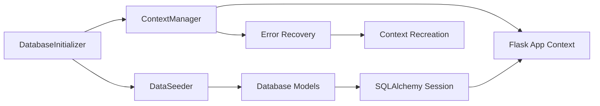

# Database Seeding Application Context Fix Design

## Overview

This design addresses the critical "Working outside of application context" error occurring during database initialization. The issue stems from the DataSeeder attempting to access Flask-SQLAlchemy models outside of a proper Flask application context. The solution involves implementing robust context management throughout the seeding process and ensuring all database operations execute within valid Flask application contexts.

## Architecture

### Context Management Flow

```mermaid
graph TD
    A[DatabaseInitializer.initialize()] --> B[Flask App Context Created]
    B --> C[DataSeeder.seed_initial_data()]
    C --> D[Context Validation Check]
    D --> E{Context Valid?}
    E -->|No| F[Create/Restore Context]
    E -->|Yes| G[Execute Seeding Step]
    F --> G
    G --> H[_create_system_tenant()]
    H --> I[_create_system_roles()]
    I --> J[_create_admin_user()]
    J --> K[Commit Database Changes]
    K --> L[Context Cleanup]
```

### Component Interaction



## Components and Interfaces

### 1. Enhanced ApplicationContextManager

**Purpose:** Centralized Flask application context management for all database operations.

**Key Methods:**
- `ensure_context()`: Decorator to ensure methods run with valid context
- `with_context()`: Context manager for explicit context control
- `validate_context()`: Check if current context is valid
- `create_context()`: Create new application context when needed
- `handle_context_error()`: Recovery mechanism for context failures

**Interface:**
```python
class ApplicationContextManager:
    def __init__(self, app: Flask):
        self.app = app
        self._context_stack = []
    
    def ensure_context(self, func):
        """Decorator to ensure function runs with valid Flask context"""
        
    def with_context(self):
        """Context manager for explicit context control"""
        
    def validate_context(self) -> bool:
        """Check if current context is valid"""
        
    def create_context(self):
        """Create new application context"""
        
    def handle_context_error(self, error: Exception) -> bool:
        """Handle context-related errors with recovery"""
```

### 2. Context-Aware DataSeeder

**Purpose:** Modified DataSeeder that ensures all database operations run within proper Flask context.

**Key Changes:**
- All public methods decorated with `@ensure_context`
- Context validation before database queries
- Automatic context recovery on failures
- Enhanced error reporting with context information

**Interface:**
```python
class DataSeeder:
    def __init__(self, app: Flask, db: SQLAlchemy):
        self.app = app
        self.db = db
        self.context_manager = ApplicationContextManager(app)
    
    @ensure_context
    def seed_initial_data(self) -> SeedingResult:
        """Main seeding method with context protection"""
        
    @ensure_context  
    def _create_system_tenant(self) -> Dict[str, Any]:
        """Create system tenant with context validation"""
        
    @ensure_context
    def _create_system_roles(self, tenant_id: int) -> Dict[str, Any]:
        """Create system roles with context validation"""
        
    @ensure_context
    def _create_admin_user(self, tenant_id: int) -> Dict[str, Any]:
        """Create admin user with context validation"""
```

### 3. Enhanced DatabaseInitializer

**Purpose:** Updated initializer that maintains context throughout the entire initialization process.

**Key Changes:**
- Explicit context management during seeding phase
- Context validation before each major step
- Enhanced error handling with context diagnostics
- Proper context cleanup on completion or failure

**Interface:**
```python
class DatabaseInitializer:
    def __init__(self, app: Flask, db: SQLAlchemy):
        self.app = app
        self.db = db
        self.context_manager = ApplicationContextManager(app)
    
    def initialize(self) -> InitializationResult:
        """Initialize with robust context management"""
        
    def _execute_seeding_with_context(self) -> SeedingResult:
        """Execute seeding with guaranteed context"""
        
    def _validate_context_before_seeding(self) -> bool:
        """Validate context before starting seeding"""
```

## Data Models

### Context State Tracking

```python
@dataclass
class ContextState:
    """Track Flask application context state"""
    has_context: bool
    app_name: Optional[str]
    request_context: bool
    database_bound: bool
    session_active: bool
    error_details: Optional[str]
    
@dataclass  
class ContextRecoveryResult:
    """Result of context recovery attempt"""
    success: bool
    context_created: bool
    error_message: Optional[str]
    recovery_method: str
```

### Enhanced SeedingResult

```python
@dataclass
class SeedingResult:
    """Enhanced seeding result with context information"""
    success: bool
    records_created: Dict[str, int] = field(default_factory=dict)
    records_skipped: Dict[str, int] = field(default_factory=dict)
    errors: List[str] = field(default_factory=list)
    warnings: List[str] = field(default_factory=list)
    duration: float = 0.0
    context_state: Optional[ContextState] = None
    context_recoveries: List[ContextRecoveryResult] = field(default_factory=list)
    timestamp: datetime = field(default_factory=datetime.now)
```

## Error Handling

### Context Error Detection

1. **Pre-operation Validation**: Check context before each database operation
2. **Runtime Error Catching**: Catch "Working outside of application context" exceptions
3. **Context State Monitoring**: Continuously monitor context validity during long operations
4. **Automatic Recovery**: Attempt to recreate context when errors are detected

### Error Recovery Strategy

```python
def handle_context_error(self, error: Exception) -> ContextRecoveryResult:
    """
    Multi-step context recovery process:
    1. Detect error type and context state
    2. Attempt to create new application context
    3. Validate database session binding
    4. Retry failed operation
    5. Log recovery details for monitoring
    """
```

### Error Messages and Logging

- **Detailed Context Information**: Include app state, session status, and stack trace
- **Actionable Guidance**: Provide specific steps to resolve context issues
- **Recovery Tracking**: Log all recovery attempts and their outcomes
- **Performance Impact**: Monitor context creation overhead

## Testing Strategy

### Unit Tests

1. **Context Manager Tests**
   - Test context creation and validation
   - Test error detection and recovery
   - Test decorator functionality
   - Test context cleanup

2. **DataSeeder Tests**
   - Test seeding with valid context
   - Test seeding with invalid context
   - Test context recovery during seeding
   - Test error handling and reporting

3. **Integration Tests**
   - Test full initialization process
   - Test context persistence across steps
   - Test background service context management
   - Test concurrent context usage

### Test Scenarios

```python
def test_seeding_without_context():
    """Test that seeding fails gracefully without context and recovers"""
    
def test_seeding_with_context():
    """Test that seeding succeeds with proper context"""
    
def test_context_recovery():
    """Test automatic context recovery during seeding"""
    
def test_background_service_context():
    """Test that background services maintain proper context"""
```

### Performance Testing

- **Context Creation Overhead**: Measure impact of context management
- **Memory Usage**: Monitor context stack and cleanup
- **Recovery Time**: Measure time to recover from context errors
- **Concurrent Context**: Test multiple contexts in background services

## Implementation Phases

### Phase 1: Core Context Management
- Implement ApplicationContextManager
- Add context validation utilities
- Create context recovery mechanisms

### Phase 2: DataSeeder Enhancement  
- Add context decorators to seeding methods
- Implement context validation in database operations
- Add enhanced error handling and reporting

### Phase 3: DatabaseInitializer Integration
- Update initialization process with context management
- Add context diagnostics and monitoring
- Implement proper context cleanup

### Phase 4: Background Services Update
- Apply context management to health checks
- Update performance monitoring services
- Ensure all background services use context manager

### Phase 5: Testing and Validation
- Comprehensive unit and integration tests
- Performance impact assessment
- End-to-end validation of context management

## Security Considerations

- **Context Isolation**: Ensure contexts don't leak between operations
- **Session Security**: Validate database session binding and permissions
- **Error Information**: Avoid exposing sensitive context details in logs
- **Resource Cleanup**: Proper cleanup to prevent context accumulation

## Performance Considerations

- **Context Caching**: Reuse contexts when possible to reduce overhead
- **Lazy Context Creation**: Only create contexts when needed
- **Context Pooling**: Consider pooling for high-frequency operations
- **Monitoring**: Track context creation/destruction patterns

## Monitoring and Observability

- **Context Metrics**: Track context creation, validation, and recovery events
- **Error Rates**: Monitor context-related error frequency
- **Performance Impact**: Measure context management overhead
- **Recovery Success**: Track context recovery success rates