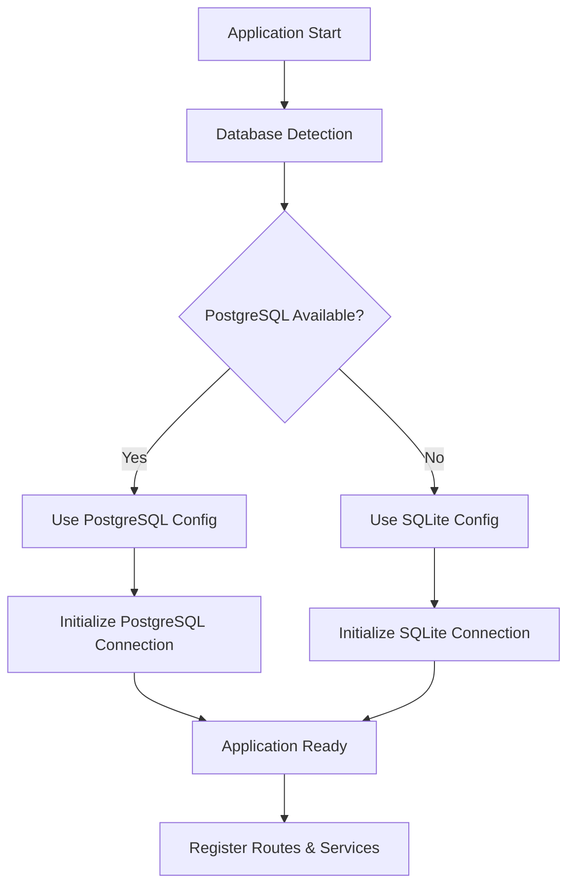

# Design Document

## Overview

This design addresses the authentication and database connectivity issues by implementing an adaptive configuration system that automatically detects available services and gracefully degrades functionality when services are unavailable. The solution maintains backward compatibility while enabling the application to run in various environments.

## Architecture

### Database Abstraction Layer



### Configuration Hierarchy

1. **Environment Variables** - Primary configuration source
2. **Database Detection** - Automatic fallback mechanism
3. **Service Discovery** - Runtime service availability checking
4. **Graceful Degradation** - Feature disabling when services unavailable

### Service Availability Matrix

| Service | Required | Fallback | Impact |
|---------|----------|----------|---------|
| PostgreSQL | No | SQLite | None (transparent) |
| Redis | No | In-memory cache | Reduced performance |
| OpenAI API | No | Disabled AI features | Feature unavailable |
| External APIs | No | Disabled integrations | Feature unavailable |

## Components and Interfaces

### 1. Adaptive Configuration Manager

**Purpose:** Dynamically configure the application based on available services

**Interface:**
```python
class AdaptiveConfigManager:
    def detect_database(self) -> str
    def detect_cache_backend(self) -> str
    def get_config_class(self) -> Type[Config]
    def validate_services(self) -> Dict[str, bool]
```

**Responsibilities:**
- Detect available database systems
- Configure appropriate database connections
- Manage service availability status
- Provide configuration objects based on environment

### 2. Database Connection Manager

**Purpose:** Handle database connections with automatic fallback

**Interface:**
```python
class DatabaseManager:
    def connect_postgresql(self) -> bool
    def connect_sqlite(self) -> bool
    def get_connection_string(self) -> str
    def migrate_if_needed(self) -> None
```

**Responsibilities:**
- Attempt PostgreSQL connection first
- Fallback to SQLite if PostgreSQL unavailable
- Handle database migrations
- Maintain connection health

### 3. Authentication Service Adapter

**Purpose:** Ensure authentication works across different database backends

**Interface:**
```python
class AuthenticationAdapter:
    def authenticate_user(self, email: str, password: str) -> Optional[User]
    def generate_tokens(self, user: User) -> Dict[str, str]
    def validate_token(self, token: str) -> Optional[User]
    def refresh_token(self, refresh_token: str) -> Dict[str, str]
```

**Responsibilities:**
- Handle user authentication regardless of database backend
- Generate and validate JWT tokens
- Manage user sessions
- Provide consistent authentication API

### 4. Service Health Monitor

**Purpose:** Monitor service availability and enable/disable features accordingly

**Interface:**
```python
class ServiceHealthMonitor:
    def check_service_health(self, service_name: str) -> bool
    def get_service_status(self) -> Dict[str, bool]
    def register_health_check(self, service_name: str, check_func: Callable) -> None
    def enable_feature(self, feature_name: str) -> None
    def disable_feature(self, feature_name: str) -> None
```

**Responsibilities:**
- Periodically check service availability
- Enable/disable features based on service status
- Provide health status API
- Manage feature flags

## Data Models

### Configuration Models

```python
@dataclass
class DatabaseConfig:
    type: str  # 'postgresql' or 'sqlite'
    connection_string: str
    schema: Optional[str] = None
    engine_options: Dict[str, Any] = field(default_factory=dict)

@dataclass
class ServiceStatus:
    name: str
    available: bool
    last_check: datetime
    error_message: Optional[str] = None

@dataclass
class ApplicationConfig:
    database: DatabaseConfig
    services: Dict[str, ServiceStatus]
    features: Dict[str, bool]
    environment: str
```

### User Authentication Models

The existing user models will be maintained but enhanced with database-agnostic queries:

```python
class User(db.Model):
    # Existing fields remain the same
    
    @classmethod
    def authenticate(cls, email: str, password: str) -> Optional['User']:
        """Database-agnostic authentication method"""
        
    def generate_tokens(self) -> Dict[str, str]:
        """Generate JWT tokens for user"""
        
    @staticmethod
    def verify_token(token: str) -> Optional['User']:
        """Verify JWT token and return user"""
```

## Error Handling

### Database Connection Errors

1. **PostgreSQL Connection Failed**
   - Log warning about PostgreSQL unavailability
   - Automatically switch to SQLite
   - Continue application startup
   - Display database type in admin interface

2. **SQLite Connection Failed**
   - Log critical error
   - Attempt to create new SQLite database
   - If creation fails, exit with clear error message

3. **Database Migration Errors**
   - Log migration errors with details
   - Provide manual migration instructions
   - Allow application to continue with existing schema

### Authentication Errors

1. **Invalid Credentials**
   - Return standardized error response
   - Log authentication attempts
   - Implement rate limiting for security

2. **Token Validation Errors**
   - Return 401 Unauthorized with clear message
   - Log token validation failures
   - Provide token refresh mechanism

3. **Database Query Errors**
   - Catch and log database-specific errors
   - Return generic error messages to users
   - Implement retry mechanisms for transient errors

## Testing Strategy

### Unit Tests

1. **Configuration Manager Tests**
   - Test database detection logic
   - Test configuration object creation
   - Test service availability checking
   - Mock external service dependencies

2. **Authentication Tests**
   - Test user authentication with both database types
   - Test JWT token generation and validation
   - Test password hashing and verification
   - Test session management

3. **Database Manager Tests**
   - Test PostgreSQL connection attempts
   - Test SQLite fallback mechanism
   - Test database migration handling
   - Test connection health monitoring

### Integration Tests

1. **End-to-End Authentication Flow**
   - Test complete login process
   - Test protected endpoint access
   - Test token refresh mechanism
   - Test logout functionality

2. **Database Switching Tests**
   - Test application startup with PostgreSQL
   - Test automatic fallback to SQLite
   - Test data consistency across database types
   - Test migration between database types

3. **Service Degradation Tests**
   - Test application behavior when Redis unavailable
   - Test feature disabling when external APIs down
   - Test graceful error handling
   - Test service recovery scenarios

### Performance Tests

1. **Database Performance**
   - Compare query performance between PostgreSQL and SQLite
   - Test connection pool behavior
   - Test concurrent access patterns
   - Measure startup time differences

2. **Authentication Performance**
   - Test login response times
   - Test token validation performance
   - Test concurrent authentication requests
   - Measure memory usage patterns

## Implementation Phases

### Phase 1: Configuration System Enhancement
- Implement AdaptiveConfigManager
- Create database detection logic
- Enhance existing configuration classes
- Add service health monitoring

### Phase 2: Database Abstraction
- Implement DatabaseManager
- Add connection fallback logic
- Enhance database initialization
- Update migration handling

### Phase 3: Authentication Integration
- Implement AuthenticationAdapter
- Update authentication endpoints
- Enhance JWT token handling
- Add session management improvements

### Phase 4: Testing and Validation
- Implement comprehensive test suite
- Perform integration testing
- Validate performance characteristics
- Document deployment procedures

## Security Considerations

1. **Database Security**
   - Ensure SQLite file permissions are restrictive
   - Implement connection encryption where possible
   - Use parameterized queries to prevent SQL injection
   - Regular security audits of database access patterns

2. **Authentication Security**
   - Use secure password hashing (bcrypt/scrypt)
   - Implement JWT token expiration and rotation
   - Add rate limiting for authentication attempts
   - Log security events for monitoring

3. **Configuration Security**
   - Secure storage of configuration secrets
   - Environment variable validation
   - Prevent configuration injection attacks
   - Regular security configuration reviews