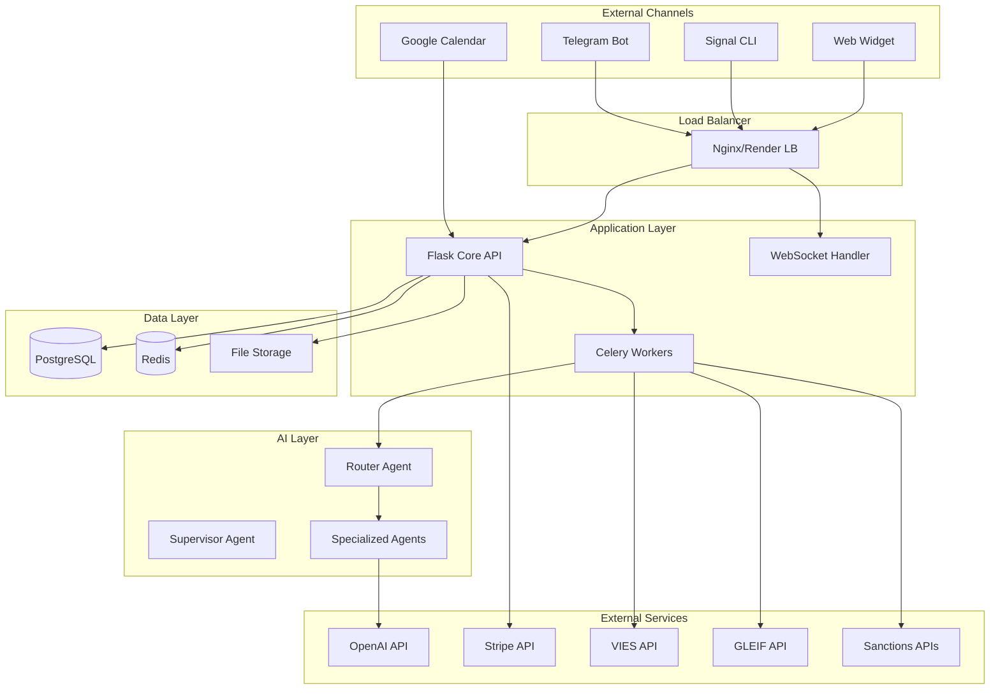

# AI-Секретар — Архітектура системи

## Загальна архітектура



## Компоненти системи

### 1. Core API Service (Flask)
**Відповідальність:**
- REST API endpoints для всієї функціональності
- WebSocket з'єднання для real-time комунікації
- Аутентифікація та авторизація (JWT)
- Multi-tenant data isolation
- Rate limiting та валідація запитів

**Ключові модулі:**
- `app/api/` - REST API endpoints
- `app/auth/` - Аутентифікація та авторизація
- `app/models/` - SQLAlchemy ORM моделі
- `app/utils/` - Спільні утиліти

### 2. Background Workers (Celery)
**Відповідальність:**
- Асинхронна обробка повідомлень
- KYB моніторинг та алерти
- Email/SMS нотифікації
- Stripe usage sync
- Scheduled tasks

**Workers:**
- `billing-worker` - Stripe інтеграція
- `kyb-monitor` - KYB перевірки
- `notifier` - Повідомлення
- `ai-processor` - AI обробка повідомлень

### 3. Multi-Agent AI System
**Router Agent:**
- Детекція мови (en/de/uk)
- Класифікація намірів
- Визначення контексту клієнта
- Маршрутизація до відповідного агента

**Supervisor Agent:**
- Фільтрація токсичного контенту
- Детекція та маскування PII
- Перевірка відповідності політикам
- Логування для compliance

**Спеціалізовані агенти:**
- Sales Agent - кваліфікація лідів
- Support Agent - технічна підтримка  
- Billing Agent - питання оплат
- Operations Agent - загальні операції

### 4. Channel Integrations
**Telegram Bot:**
- Webhook обробка повідомлень
- Підтримка команд та inline keyboards
- File upload handling
- Group та private чати

**Signal Integration:**
- signal-cli wrapper
- Polling для вхідних повідомлень
- Group та individual conversations
- Media message support

**Web Widget:**
- JavaScript widget для сайтів
- WebSocket real-time комунікація
- Customizable UI/UX
- CORS та security headers

## Схема даних (високий рівень)

### Tenancy & Users
```sql
tenants (id, name, domain, slug, settings, subscription_status, trial_ends_at)
users (id, tenant_id, email, role, language, is_active)
audit_logs (id, tenant_id, user_id, action, resource_type, old_values, new_values)
```

### Billing & Subscriptions  
```sql
plans (id, name, price, features, limits)
subscriptions (id, tenant_id, plan_id, stripe_subscription_id, status)
entitlements (id, tenant_id, feature, limit_value, used_value)
usage_events (id, tenant_id, event_type, quantity, timestamp)
```

### Omnichannel Communication
```sql
channels (id, tenant_id, type, config, is_connected)
threads (id, tenant_id, channel_id, customer_id, status, ai_enabled)
inbox_messages (id, tenant_id, thread_id, content, direction, ai_response)
attachments (id, message_id, filename, file_path, mime_type)
```

### CRM
```sql
contacts (id, tenant_id, email, name, company, metadata)
pipelines (id, tenant_id, name, stages_order)
stages (id, pipeline_id, name, position, is_won, is_closed)
leads (id, tenant_id, contact_id, pipeline_id, stage_id, value, probability)
tasks (id, tenant_id, lead_id, assigned_to_id, title, due_date, status)
notes (id, tenant_id, lead_id, user_id, content, is_private)
```

### Calendar Integration
```sql
calendars (id, tenant_id, google_calendar_id, oauth_tokens)
events (id, tenant_id, calendar_id, google_event_id, title, start_time, end_time)
bookings (id, tenant_id, event_id, customer_email, status)
```

### Knowledge Management
```sql
knowledge_sources (id, tenant_id, name, type, url, status)
documents (id, source_id, title, content, metadata)
chunks (id, document_id, content, position, embedding_vector)
```

### Invoicing
```sql
invoices (id, tenant_id, stripe_invoice_id, amount, status, due_date)
payments (id, invoice_id, stripe_payment_id, amount, status, paid_at)
```

### KYB Monitoring
```sql
counterparties (id, tenant_id, name, vat_number, lei_code, country, risk_score)
counterparty_snapshots (id, counterparty_id, source, data_hash, raw_data)
counterparty_diffs (id, counterparty_id, old_snapshot_id, new_snapshot_id, changes)
alerts (id, tenant_id, counterparty_id, type, severity, message, is_read)
```

## Інтеграції

### OpenAI API
- **Модель:** GPT-4 Turbo для складних задач
- **Embeddings:** text-embedding-ada-002 для RAG
- **Function calling:** Для інтеграції з CRM/Calendar
- **Rate limiting:** Exponential backoff
- **Fallback:** Кешування відповідей

### Stripe Integration
- **Products & Prices:** Тарифні плани
- **Subscriptions:** Управління підписками
- **Usage Records:** Metering для overages
- **Webhooks:** Real-time статус оновлення
- **Checkout:** Hosted payment pages

### Google Calendar
- **OAuth 2.0:** Авторизація користувачів
- **Calendar API:** Читання/створення подій
- **Webhooks:** Push notifications про зміни
- **Batch requests:** Оптимізація API calls

### KYB Data Sources
- **VIES:** EU VAT validation (SOAP API)
- **GLEIF:** LEI validation (REST API)
- **EU Sanctions:** Consolidated list parsing
- **OFAC:** SDN list processing
- **UK Sanctions:** HMT list processing
- **Insolvenz:** German insolvency notifications

## Deployment Architecture

### Development Environment
```yaml
services:
  app:
    build: .
    ports: ["5000:5000"]
    environment:
      - FLASK_ENV=development
      - DATABASE_URL=postgresql://user:pass@db:5432/ai_secretary
    depends_on: [db, redis]
    
  db:
    image: postgres:15
    environment:
      POSTGRES_DB: ai_secretary
      POSTGRES_USER: ai_secretary_user
      POSTGRES_PASSWORD: ai_secretary_pass
    ports: ["5432:5432"]
    
  redis:
    image: redis:7-alpine
    ports: ["6379:6379"]
    
  worker:
    build: .
    command: celery -A celery_app.celery worker --loglevel=info
    depends_on: [db, redis]
```

### Production (Render.com)
**Web Service:**
- Auto-deploy from GitHub
- Health checks на `/health`
- Environment variables через dashboard
- Horizontal scaling ready

**Database:**
- Managed PostgreSQL
- Automated backups
- Connection pooling
- Schema isolation (`ai_secretary` schema)

**Redis:**
- Managed Redis instance
- Persistence enabled
- Memory optimization

**Background Jobs:**
- Separate worker service
- Same codebase, different start command
- Shared database and Redis

### Security Considerations
- **Data Encryption:** At rest and in transit
- **API Security:** Rate limiting, input validation
- **Authentication:** JWT with refresh tokens
- **Authorization:** Role-based access control
- **Audit Logging:** All user actions logged
- **PII Protection:** Automatic detection and masking
- **GDPR Compliance:** Data retention and deletion

### Monitoring & Observability
- **Health Checks:** `/health` endpoint
- **Metrics:** Prometheus-compatible metrics
- **Logging:** Structured JSON logs
- **Error Tracking:** Automatic error reporting
- **Performance:** Response time monitoring
- **Uptime:** External monitoring service

### Scalability Strategy
- **Horizontal Scaling:** Multiple app instances
- **Database:** Read replicas for heavy queries
- **Caching:** Redis for session and API caching
- **CDN:** Static assets delivery
- **Queue Management:** Celery with Redis broker
- **Load Balancing:** Render.com built-in LB

## Data Flow Examples

### Incoming Message Processing
1. Webhook receives message from Telegram/Signal
2. Message stored in `inbox_messages`
3. Celery task queued for AI processing
4. Router Agent determines intent and customer
5. Specialized Agent generates response
6. Supervisor Agent validates response
7. Response sent back through channel
8. All interactions logged for audit

### KYB Monitoring Flow
1. Scheduled task runs daily/weekly
2. Fetch current data from all sources
3. Compare with previous snapshots
4. Generate diffs for changes
5. Calculate risk score updates
6. Create alerts for significant changes
7. Send notifications to relevant users
8. Store evidence snapshots for compliance

### Lead Management Flow
1. Customer inquiry creates new thread
2. AI Agent qualifies the inquiry
3. Lead automatically created in CRM
4. Lead assigned to appropriate pipeline stage
5. Tasks created for follow-up
6. Calendar integration for scheduling
7. Progress tracked through pipeline
8. Invoice generated upon closing